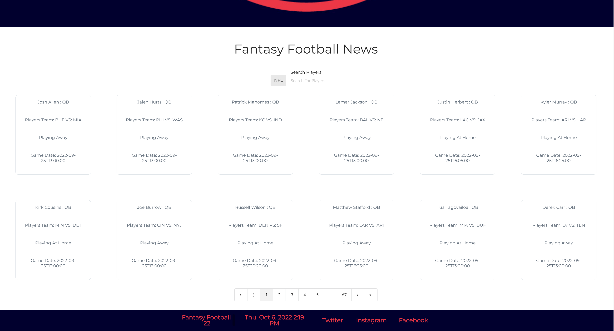

# Fantasy Football Command Center

Fantasy Football Command Center is a React + Express fantasy football app focused on a Sleeper-backed command center workflow. The current repository contains an actively maintained command center slice plus legacy projections/schedule UI routes.

## Project Overview

The app serves a browser UI and an application-facing API from the same Node.js process.

- Frontend: React single-page app bundled with Webpack.
- Backend: Express server exposing command center endpoints.
- Data provider: Sleeper API via server-side adapter, validation, and normalization.

The main user flow today is on the home route, where users can look up a Sleeper username, choose a league, and inspect normalized league data.

## Screenshots

Homepage and branding assets in this repository:




## Current Features

### Active command center flow

- Sleeper username lookup.
- League list for resolved season.
- League selection and normalized detail view.
- Roster, draft, and matchup sections (when data is available).
- Week selector based on resolved NFL state.
- Safe error handling and warning surfaces for partial upstream failures.
- Cache status signaling (`fresh`, `stale`, `miss`) in the UI response metadata.

### API endpoints

- `GET /api/health`
- `GET /api/command-center`
- `POST /api/command-center`

### Existing legacy routes

- `/WeeklyProjections`
- `/PPR`
- `/Schedule`

These routes still exist in routing and navigation, but their underlying data contexts are currently placeholder/no-op implementations.

## Technology Stack

- Node.js + npm
- React 18
- Express 4
- Webpack 5 + Babel
- Styled Components + Semantic UI React
- Zod (server-side runtime schema validation)
- `node:test` (test runner)
- JSDOM + `@babel/register` (router and integration-style tests)

## Requirements

- Node.js: `>=20 <21`
- npm: `>=10 <11`

Version constraints are defined in [package.json](package.json) and Node is pinned in [.nvmrc](.nvmrc) to `20`.

## Installation And Local Setup

```bash
npm install
```

Start server and frontend in separate terminals:

```bash
npm run server
npm run dev
```

Or run both together:

```bash
npm run serve
```

Notes:

- `npm run server` starts Express on `PORT` (default `8080`).
- `npm run dev` starts `webpack-dev-server` on an available port starting at `5000`.
- `package.json` has `proxy: http://localhost:8080`, so frontend API calls in dev proxy to the Express server.

## Environment Variables

Confirmed variables currently used by repository code:

- `PORT`: optional server port for Express (`server.js`), default is `8080`.
- `NODE_ENV`: influences webpack mode in `webpack.config.js`.

There is no committed `.env.example` in this repository. `.env` and local variants are gitignored.

Minimal local example:

```bash
PORT=8080
NODE_ENV=production
```

Do not commit real secrets or credentials.

## npm Scripts

All script names below are defined in [package.json](package.json):

- `npm run dev`: start webpack dev server.
- `npm run server`: start Express server.
- `npm run serve`: run frontend and backend concurrently.
- `npm run start`: start Express server (same runtime target as `server`).
- `npm run build`: run webpack build.
- `npm run build2`: duplicate webpack build command.
- `npm run clean`: runs `build` then `build2`.
- `npm test`: run Node test suite.
- `npm run prettier`: format repository with Prettier.
- `npm run kill`: kill node processes by name.
- `npm run babel-node`: utility Babel node command.

Maintenance scripts that are present but potentially destructive:

- `npm run restart` (removes lockfile and `node_modules`, updates dependencies).
- `npm run push` (contains `git add .` and force push behavior).

Use caution with these scripts.

## High-Level Architecture

```text
Browser (React UI)
  -> components/api/commandCenterApi.js
  -> Express API (server/createApp.js)
  -> Command center service (server/lib/commandCenterService.js)
  -> Sleeper client adapter (server/lib/sleeperClient.js)
  -> Sleeper API
```

Key backend behaviors:

- External payload validation with Zod schemas.
- Normalization into app-specific response models.
- TTL cache with stale fallback for transient upstream errors.
- Retry strategy for retryable upstream failures.
- Safe error shaping (`code`, `message`, `status`, `retryable`).

Key frontend routing behavior:

- Custom client router in `components/routing/SimpleRouter.jsx`.
- Main route (`/`) renders the command center flow.
- Legacy routes are still navigable but currently depend on placeholder context providers.

## Testing, Build, And Audit Commands

Primary validation commands:

```bash
npm test
npm run build
npm audit --omit=dev
git diff --check
```

CI workflow exists at [.github/workflows/ci.yml](.github/workflows/ci.yml) and runs:

- `npm ci`
- `npm test`
- `npm run build`
- `npm audit --omit=dev --audit-level=critical`

## Deployment Information

Confirmed in repository:

- Express serves static assets from the `build/` directory.
- A catch-all route sends `build/index.html` for client-side routing.
- No platform-specific deployment config is present (no Dockerfile, Procfile, Vercel config, or Netlify config in this repository).

If deploying this app, ensure build artifacts are generated and the Node server process runs `server.js`.

## Known Limitations

- Command center is the primary maintained flow; legacy routes currently have placeholder/no-op data providers.
- No committed `.env.example` is provided.
- `webpack.config.js` production behavior depends on `NODE_ENV`; `npm run build` does not set it explicitly.
- Repository currently includes `build/` artifacts in version control.
- Some package scripts are operationally risky (`restart`, `push`) and not suitable for normal development flow.

## Development Roadmap

Repository-confirmed direction from current code and docs:

1. Continue expanding normalized Sleeper-backed command center capabilities.
2. Improve league detail workflows (deeper roster/matchup presentation).
3. Revisit legacy projections/schedule routes so they either use active providers or are clearly retired.
4. Add a committed environment template (`.env.example`) with non-sensitive defaults.

## Contribution And Development Guidance

- Use Node 20 and npm 10 to match engine constraints.
- Prefer incremental changes aligned with existing architecture.
- Run tests and build locally before opening changes.
- Avoid committing secrets, local environment files, or machine-specific artifacts.

## Useful Links

- Portfolio/site from package metadata: https://johnfleurimond.netlify.app
- GitHub profile link used in app footer: https://github.com/JOHNFLEURIMOND
- LinkedIn link used in app footer: https://www.linkedin.com/in/john-fleurimond/
