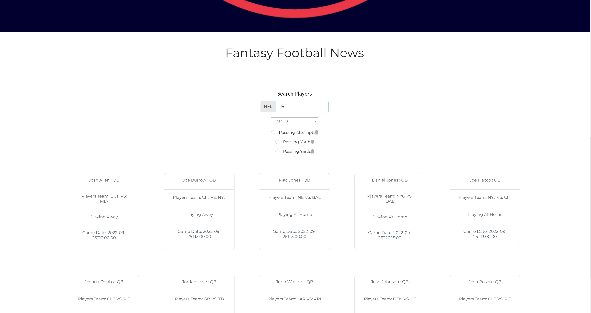

# :checkered_flag:What It Looks Like :checkered_flag::

# How It's Made :nut_and_bolt:🔨 :hammer::wrench::

This application is built with React, Semantic UI, & Sportsdata.io API.

# How It's Works:white_check_mark::🖥 & Lessons Learned :mortar_board:

A user can get the most recent fantasy football news from Rotoworld Fantasy Pros; search for their favorite player for projections for the following games and average stats per game.

The pages on the website are primarily created from three main components, FantasyFootballRanking, WeeklyProjections, and PPR, with two different API calls to Sportsdatas' API. First, I made a card component using Styled-Components that will populate the data on individual cards in a grid format once the promises come back from the API call. Suppose the user would like to see more players. In that case, there is a search bar to search for whatever player you like or find on the bottom of the page using the Pagination component I created using Semantic UI's library, which made it easier to display once I passed it props from the parenting component.

# Portfolio :open_file_folder::

** :computer: 🇭🇹 WEBSITE:** [John Fleurimond](https://johnfleurimond.netlify.app)

## Installation

1.  Clone repo
2.  run `npm install`

# How To Get It Started :arrow_forward: :

In the project directory, you can run: `npm run dev`
